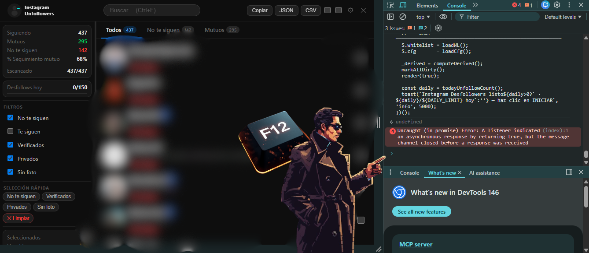

<div align="center">

# 🕵️ Instagram Unfollowers

**Descubre quién no te sigue de vuelta — directo en el navegador, sin apps, sin instalar nada.**


<br/>



<br/>

</div>

---

## ¿Qué es?

Un script de una sola línea que inyectas en Instagram desde la consola del navegador. Escanea tu lista completa de seguidos, detecta quién no te sigue de vuelta, y te permite dejar de seguirlos de forma controlada — con delays automáticos para proteger tu cuenta.

Sin extensiones. Sin apps de terceros. Sin acceso a tu contraseña. Todo ocurre dentro de tu propio navegador.

---

## Instalación

### Opción A — Consola del navegador (más rápido)

1. Abre [instagram.com](https://www.instagram.com) y asegúrate de estar logueado
2. Abre las DevTools: `F12` en Windows/Linux · `Cmd+Opt+I` en Mac
3. Ve a la pestaña **Console**
4. Pega el contenido completo de `instaun.js` y presiona `Enter`

### Opción B — Snippet guardado (recomendado)

1. En Chrome: DevTools → **Sources** → **Snippets** → `+ New snippet`
2. Pega el contenido del script y guarda con `Ctrl+S`
3. Ejecuta con `Ctrl+Enter` cada vez que estés en Instagram

### Opción C — Bookmarklet

Crea un marcador con esta URL (reemplaza `URL` con donde alojes el archivo):

```
javascript:(function(){var s=document.createElement('script');s.src='https://TU_SERVIDOR/instaun.js';document.body.appendChild(s);})();
```

> Para inyectarlo de nuevo mientras está abierto, ejecuta el script otra vez — se cierra automáticamente.

---

## Cómo usarlo

```
1.  Abre Instagram en el navegador
2.  Inyecta el script (ver instalación arriba)
3.  Aparece el panel → clic en 🕵️ INICIAR
4.  Espera a que termine el escaneo
5.  Usa los filtros, selecciona, y deja de seguir
```

### Pestañas disponibles

| Pestaña | Qué muestra |
|---------|-------------|
| **Todos** | Toda tu lista de seguidos |
| **No te siguen** | Los que tú sigues pero no te siguen de vuelta |
| **Mutuos** | Seguimiento recíproco |

---

## Características

### Escaneo

- Recorre automáticamente toda tu lista de seguidos usando la API oficial de Instagram
- **Retardo adaptativo** — reduce la velocidad automáticamente ante rate limiting (429) y se recupera gradualmente
- **Pausa y continúa** — detén el escaneo en cualquier momento sin perder el progreso
- **Guardar y reanudar** — cierra el navegador y continúa hasta 24 horas después con el botón "↩ Continuar escaneo anterior"
- **ETA en tiempo real** — muestra el tiempo estimado restante
- **Sin duplicados** — cada usuario aparece exactamente una vez, incluso si reanudan múltiples veces

### Desfollows seguros

- **Límite diario automático** — para automáticamente al llegar a 150 desfollows/día
- **Barra de progreso diaria** — visualiza el límite consumido en el sidebar
- **Historial persistente** — guarda los últimos 500 desfollows con fecha entre sesiones
- **Confirmación configurable** — confirmación global o usuario por usuario
- **Pausa y resume** — puedes detener el proceso de desfollows en mitad

### Lista blanca

- Protege cuentas que no quieres tocar
- Clic en el avatar de cualquier usuario → entra o sale de la lista al instante (overlay ★/☆)
- Exportar/importar como JSON para backup
- Gestión completa desde ⚙ Configuración

### Filtros y selección

- Filtrar por: No te siguen · Te siguen · Verificados · Privados · Sin foto de perfil
- **Selección rápida** — selecciona toda una categoría con un clic
- Búsqueda por usuario o nombre completo
- 50 usuarios por página con salto directo a cualquier página
- Exportar vista actual en JSON o CSV

---

## Configuración

Accede desde el ícono ⚙ en la barra superior.

### Tiempos de escaneo

| Parámetro | Por defecto | Rango | Descripción |
|-----------|:-----------:|:-----:|-------------|
| Retardo entre peticiones | `1200 ms` | 500 – 30000 | Tiempo entre cada página de la API |
| Pausa cada 6 peticiones | `12000 ms` | 2000 – 120000 | Pausa larga para evitar detección |
| Retardo adaptativo | `activado` | — | Auto-ajuste ante errores 429 |

### Tiempos de desfollows

| Parámetro | Por defecto | Rango | Descripción |
|-----------|:-----------:|:-----:|-------------|
| Retardo entre desfollows | `4000 ms` | 1000 – 30000 | Tiempo entre cada unfollow |
| Pausa cada 5 desfollows | `300000 ms` | 60000 – 600000 | Pausa de enfriamiento |

> ⚠ **No reduzcas los tiempos** sin entender el riesgo. Los valores por defecto están calibrados para ser seguros.

---

## Límites de seguridad

Instagram no publica sus límites oficiales, pero estos son los valores de referencia usados por la comunidad:

| Acción | Límite seguro diario |
|--------|---------------------:|
| Desfollows | **~150 / día** |
| Desfollows | **~60 / hora** |

El script bloquea automáticamente al alcanzar 150 desfollows en el día. El contador se reinicia cada medianoche.

---

## Privacidad y seguridad

| | |
|---|---|
| 🔒 **Sin backend** | El script corre completamente en tu navegador. Ningún dato sale a servidores externos. |
| 🔑 **Sin contraseña** | Solo usa tu sesión activa (cookies). No pide ni almacena credenciales. |
| 🧩 **Sin extensión** | No requiere permisos permanentes ni acceso especial al navegador. |
| 💾 **Almacenamiento local** | Whitelist, configuración e historial se guardan en `localStorage` de tu propio navegador. |
| 🛡 **CSP-compatible** | Código sin handlers inline — cumple con la Content Security Policy de Instagram. |

---

## Atajos de teclado

| Tecla | Acción |
|-------|--------|
| `←` o `h` | Página anterior |
| `→` o `l` | Página siguiente |
| `Ctrl + F` | Enfocar búsqueda |
| `Esc` | Cerrar configuración |

---

## Compatibilidad

| Navegador | Soporte |
|-----------|:-------:|
| Chrome 90+ | ✅ |
| Edge 90+ | ✅ |
| Firefox 88+ | ✅ |
| Safari 14+ | ✅ |
| Brave | ✅ |

Requiere estar logueado en [instagram.com](https://www.instagram.com) desde el navegador de escritorio.  
No funciona en la app móvil ni en navegadores embebidos.

---

## Preguntas frecuentes

<details>
<summary><b>¿Puede banearse mi cuenta?</b></summary>

Usar el script con los tiempos por defecto es de bajo riesgo, pero no hay garantía absoluta. Instagram puede cambiar sus algoritmos en cualquier momento. Se recomienda respetar el límite diario de 150 y no reducir los delays.

</details>

<details>
<summary><b>¿Por qué el escaneo es lento?</b></summary>

Es intencional. Los delays entre peticiones imitan el comportamiento humano para evitar ser detectado por los sistemas antispam de Instagram.

</details>

<details>
<summary><b>¿Se puede reanudar si cierro el navegador?</b></summary>

Sí. Usa el botón "💾 Guardar progreso" o simplemente pausa el escaneo. Al inyectar el script de nuevo aparecerá el botón "↩ Continuar escaneo anterior" con el progreso guardado. El resume expira a las 24 horas.

</details>

<details>
<summary><b>¿Los datos son privados?</b></summary>

Completamente. Todo se queda en tu navegador. Si limpias los datos del navegador (`localStorage`), se borra el historial y la whitelist.

</details>

<details>
<summary><b>¿Funciona con cuentas grandes (5000+ seguidos)?</b></summary>

Sí. El escaneo puede tardar varios minutos — con 5000 seguidos y los delays por defecto, aproximadamente 8-12 minutos. El retardo adaptativo ajusta automáticamente la velocidad si Instagram empieza a ralentizar las respuestas.

</details>

<details>
<summary><b>¿Qué pasa si Instagram cambia su API?</b></summary>

El script usa la misma API interna que usa el sitio web de Instagram. Si cambia, el script dejará de funcionar y habrá que actualizarlo. Verifica siempre que estés usando la versión más reciente.

</details>

---

## Estructura del proyecto

```
instaun.js   ← Script principal (inyectable)
README.md                      ← Esta documentación
preview.png                    ← Screenshot de portada (añade el tuyo)
```

---

## Aviso legal

> Este script es una herramienta de uso personal para gestionar tu propia cuenta de Instagram. El uso de herramientas de automatización puede violar los [Términos de Servicio de Instagram](https://help.instagram.com/581066165581870). El autor no se hace responsable del uso indebido ni de las consecuencias que pueda tener sobre tu cuenta. **Úsalo bajo tu propia responsabilidad.**

---

## Licencia

```
MIT License — libre para usar, modificar y distribuir con atribución.
```

---

<div align="center">

Hecho con ☕ · Cualquier mejora es bienvenida como Pull Request

</div>
